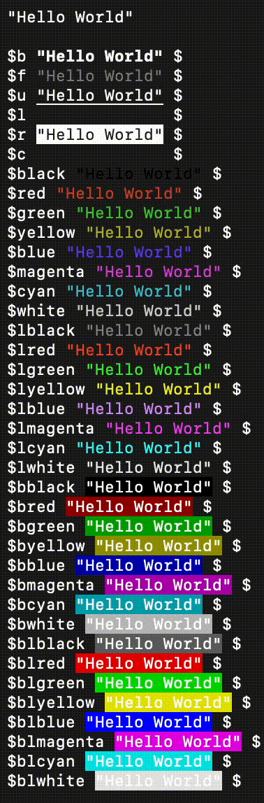

# colors.h



## Use

Use `${fmt}` followed by whatever string you want to be formatted and clear formatting using `$`

Besides the formats shown above, you can use `$256(int)` for the 256 non-standard colors, and `$rgb(r, g, b)` for any color (also non-standard).

```c
#include <colors.h>

int main() {
    // error
    printf($b $red "error:" $ " Something bad happened\n");

    //warning
    printf($yellow "warning:" $ " This isn't so bad\n");
}